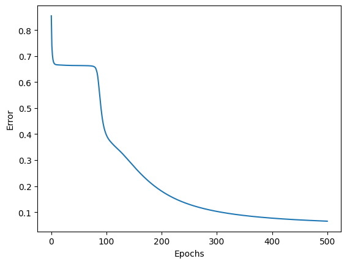
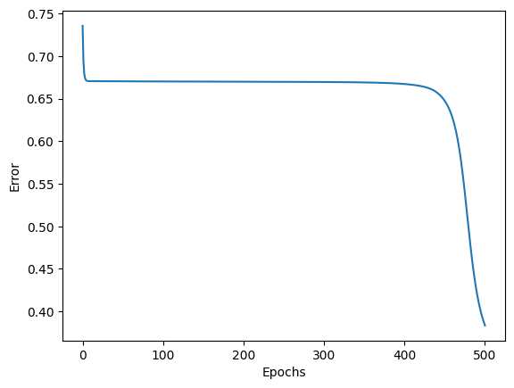
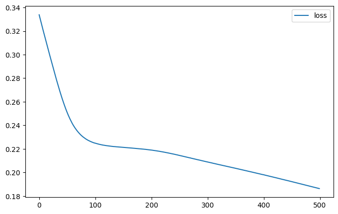
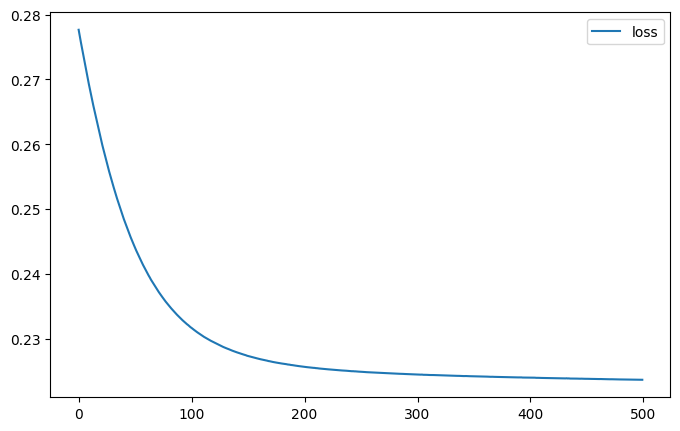
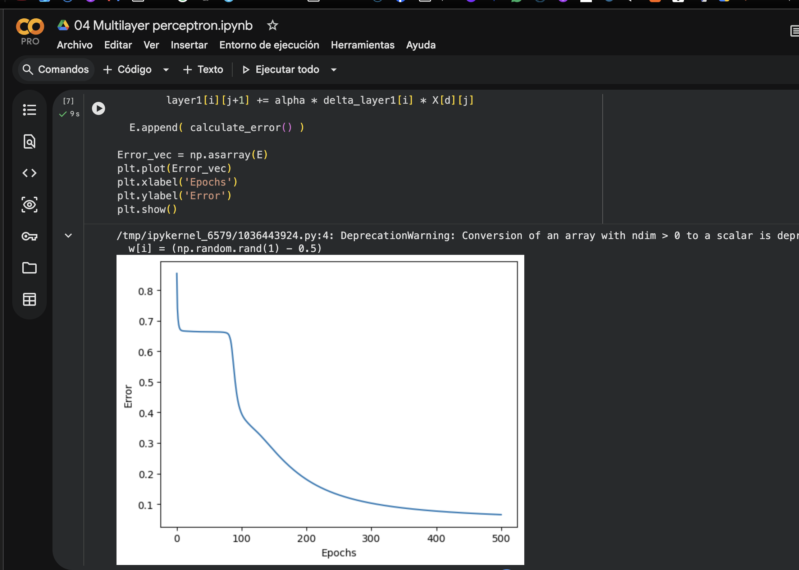

## Objetivo

Correr ambas notebooks en **Google Colab** con la arquitectura original,
**agregar dos capas** a cada red, volver a entrenar y **comparar** qué cambia
(curva de error/pérdida, velocidad, calidad de la clasificación).

## Archivos a crear / modificar

No modifiques las notebooks originales del repositorio.

1. Sube a Colab una **copia** de cada notebook (o ábrela desde GitHub / Drive).
2. En esas copias, después de la corrida original, deja una **segunda versión**
   de la red con dos capas extra (puedes duplicar celdas para no perder la
   corrida de referencia).

## Requisitos

1. Ejecuta **primero** las dos notebooks **sin cambiar** la topología
   \(4 \times 3 \times 3\). Guarda las gráficas de error/pérdida.
2. Agrega **exactamente dos capas ocultas** a **cada** red. La entrada sigue
   siendo 4 y la **salida sigue siendo 3** (Iris tiene 3 clases). Topología
   pedida:

   \[
   4 \times 3 \times 3 \times 3 \times 3
   \]

   (cuatro capas de 3 neuronas: tres ocultas + salida). Usa **sigmoide** en
   todas las capas, el mismo \(\eta = 0.03\) y las mismas **500 épocas**, para
   que la comparación sea justa.
3. En la notebook **01** debes actualizar **todas** las partes que asumen dos
   capas: tamaños, `init_weights`, el forward de `calculate_error` y el ciclo
   de entrenamiento (propagación **y** retropropagación). No basta con declarar
   dos listas más si el backprop no las usa.
4. En la notebook **02** añade dos `layers.Dense(3, activation="sigmoid", ...)`
   **antes** de la capa de salida. `model.summary()` debe mostrar **4** capas
   `Dense`.
5. El análisis comparativo cubre **cuatro** corridas: original vs. más profunda,
   en implementación a mano **y** en Keras.

## Pasos sugeridos

1. Abre [Google Colab](https://colab.research.google.com/). Sube las notebooks
   (`Archivo` → `Subir notebook`) o ábrelas desde Drive.

2. En Colab, TensorFlow ya está instalado. Ejecuta **Runtime → Run all** en
   cada notebook original. Anota:
   - la curva de error (notebook 01) o de `loss` (notebook 02);
   - el valor de error/pérdida al **final** de las 500 épocas;
   - (notebook 02) el `model.summary()` y una predicción de ejemplo.

3. Duplica las celdas de arquitectura y entrenamiento (o crea una sección
   “red profunda”) y cambia la topología a \(4 \times 3 \times 3 \times 3 \times 3\).

   En Keras el esqueleto queda así (completa nombres y el resto del notebook):

   ```python
   model = keras.Sequential(
     [
       layers.Dense(3, activation="sigmoid", name="layer1", input_shape=(4,)),
       layers.Dense(3, activation="sigmoid", name="layer2"),
       layers.Dense(3, activation="sigmoid", name="layer3"),
       layers.Dense(3, activation="sigmoid", name="layer4"),
     ]
   )
   ```

   En la notebook 01 tendrás `layer1` … `layer4`. El backprop recorre las capas
   **de la salida hacia la entrada**: el \(\delta\) de una capa oculta usa los
   pesos y los \(\delta\) de la capa **siguiente**.

4. Vuelve a entrenar 500 épocas con \(\eta = 0.03\). Guarda las nuevas curvas
   y, si puedes, el tiempo de la celda de entrenamiento.

5. Redacta el análisis comparativo (ver entrega).

## Criterios de aceptación

- Las dos notebooks originales corrieron en **Colab** (no solo en tu máquina).
- Cada red profunda tiene **dos capas extra**; la salida sigue siendo de
  **3** neuronas.
- La notebook 01 actualiza forward **y** backprop (no solo la inicialización).
- Hay evidencias (capturas) de las **cuatro** corridas: curvas y, en Keras,
  `model.summary()` original y profundo.
- El reporte compara implementación a mano vs. Keras **y** red original vs.
  red más profunda; no es un resumen de lo que “debería” pasar sin números.

## Entrega

1. Enlaces de Colab (o archivos `.ipynb`) de las dos notebooks **modificadas**,
   con las corridas originales y las profundas.
2. Capturas: curvas de error/pérdida de las cuatro corridas y los dos
   `model.summary()` de Keras.
3. Un breve reporte (media página a una página) que responda:
   - ¿Bajar más el error al añadir dos capas, o se estancó / empeoró? ¿Igual
     en NumPy y en Keras?
   - ¿Las curvas de la notebook 01 y de Keras se parecen con la misma
     topología? Si no, ¿qué diferencias de implementación podrían explicarlo
     (orden de los datos, inicialización, vectorización, etc.)?
   - Con sigmoides apiladas y MSE, ¿tiene sentido que una red **más profunda**
     no aprenda mejor en Iris? Relaciónalo con lo que viste en las gráficas.
4. Evidencias de haber ejecutado en Colab (captura del entorno Colab o del
   menú Runtime).


links:
04 Multilayer perceptron_modificada.ipynb:
https://colab.research.google.com/drive/1IEzOcxZ_qb8HX8JtiHqOYslHzrKDxzKd?usp=sharing

05 Keras - multilayer perceptron_modificada - iris.ipynb:
https://colab.research.google.com/drive/1_IZGSRB_W05FWQmCAZGknTaoG9W9m0aE?usp=sharing


keras with only two layers

### Model: `sequential_4`

| Layer (type) | Output Shape | Param # |
| :--- | :--- | :---: |
| **layer1** (Dense) | `(None, 3)` | 15 |
| **layer2** (Dense) | `(None, 3)` | 12 |

* **Total params:** 27 (108.00 B)
* **Trainable params:** 27 (108.00 B)
* **Non-trainable params:** 0 (0.00 B)

Keras with four layers

### Model: `sequential_5`

| Layer (type) | Output Shape | Param # |
| :--- | :--- | :---: |
| **layer1** (Dense) | `(None, 3)` | 15 |
| **layer2** (Dense) | `(None, 3)` | 12 |
| **layer3** (Dense) | `(None, 3)` | 12 |
| **layer4** (Dense) | `(None, 3)` | 12 |

* **Total params:** 51 (204.00 B)
* **Trainable params:** 51 (204.00 B)
* **Non-trainable params:** 0 (0.00 B)

Reporte de resultados

Mis resultados son extraños y variados, estoy sorprendido de como al agregar más capas, el resultado no mejora, al buscar diferencias en la ejecucion inicial de numpy con la arquitectura original y comparandola con la ejecucion con capas extra, se puede observar como en las primera  epocas hay una perdida de error constante, pero se queda estancado (casi se aplana la grafica) hasta llegar a la epoca 100 en la cual empieza a bajar de nuevo de manera constante. En cambio con la nueva arquitectura se puede observar como un comportamiento similar en las primeras capaz, pero aqui el estancamiento no se detiene en las primeras 100 epocas, continua hasta casi las ultimas en las cuales ya se empieza a notar una caida rapida del error, pero apesar de eso, **al finalizar el entrenamiento en ambas arquitecturas, la nueva arquitectura tiene un error final mucho mayor ~0.1 en la original contra ~0.4 en la nueva.**

Respecto a la ejecucion con keras, con la arquitectura original,  se puede ver un comportamiento diferente, al aumentar las capas el error disminuye de manera constante a lo largo de todas las epocas, y con la curva aplanandose antes de la epoca 100 hasta la epoca 200, pero siempre mostrando una reduccion en el error, y en el caso de la nueva arquitectura se puede observar una curva que muestra la reduccion del error de manera constante, **al finalizar el entrenamiento en ambas arquitecturas, hay un error final similar en ambas ~0.2 en la original contra ~0.23 en la nueva.**

Respecto a las diferencias en la implementacion de numpy y keras, hay algunas diferencias en la implementacion que estan relacionadas con las diferencias en las curvas, la manera en que se calcula la perdida, en el caso de numpy estamos dividiendo todo entre len(x) que es 150 siempre, mientras que keras usa MeanSquaredError, que divide entre 150 multiplicado por las capas.

Tambien hay que mencionar que numpy usa valores entre 0 y 1 mientras que keras usa GlorotUniform.


Debido a **Desvanecimiento del gradiente** se puede ver como la red con la nueva arquitectura, tiene mas problemas para aprender, ya que al apilar cuatro capas y multiplicar cada una por un numero decimal (.25) el valor se va reduciendo hasta ser casi imperceptible.

Simplicidad de Iris: Son solo 150 muestras y 4 variables; una sola capa oculta es suficiente. Dos capas extra añaden cuellos de botella saturados que impiden el paso de información.


### Evidencias Gráficas

#### Implementación Manual (NumPy)



#### Implementación Keras



#### Entorno Google Colab

