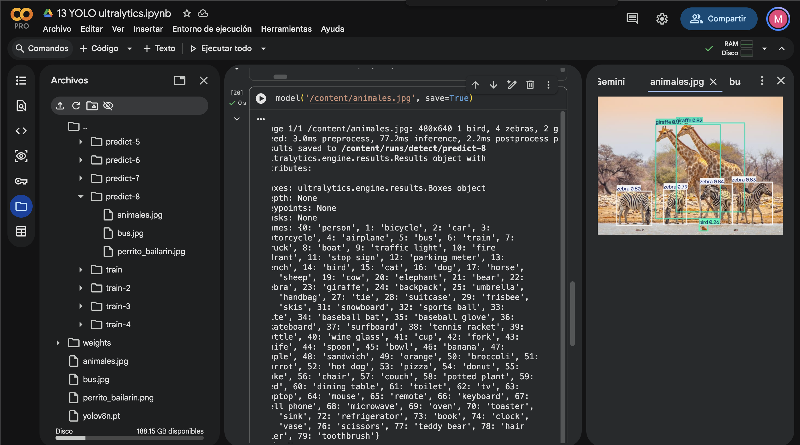
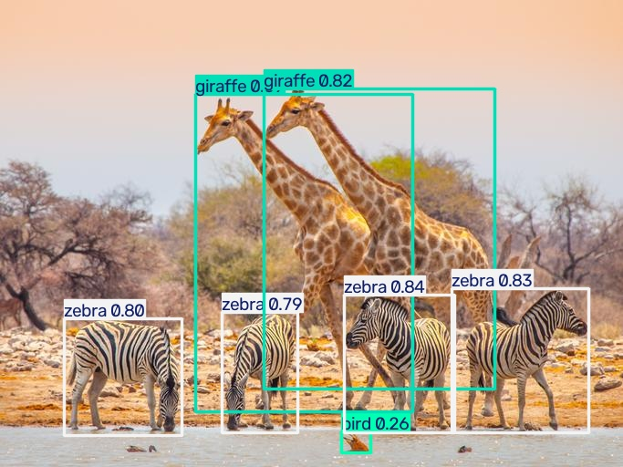
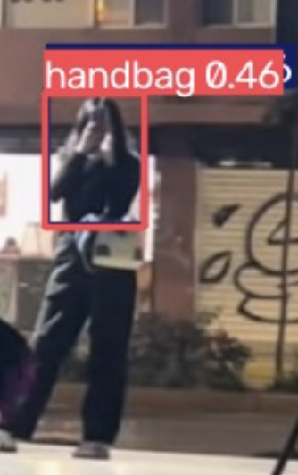
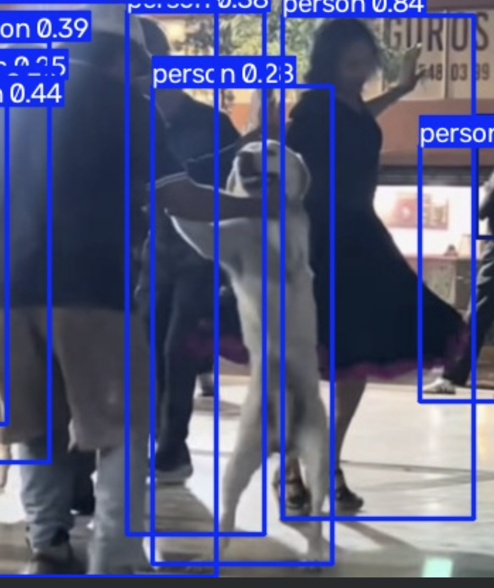
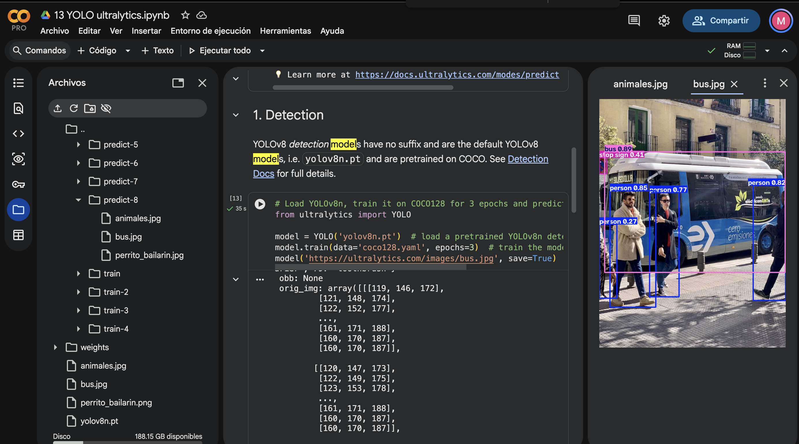

Para este ejercicio utilice dos fotos una en la que es fácil identificar a los animales y una de un perrito bailando para el reto opcional.

En el caso de zidane se detectaron dos clases, la de tie y la de person, para la de bus, se detectó al autobus, una señal de alto y a muchas personas.

En las fotos que yo agregue se detectaron jirafas, cebras y personas y un bolso, en la foto que subi de un perrito bailando con un threshold bajo la herramienta pudo detectar un sinfin de personas aun cuando no se veian muy claramente, pero cuando se aumenta el threshold ya solo aparecen las personas que se ven muy claramente.

Me sorprendio mucho que la herramienta no fuera capaz de detectar al señor de espaldas que esta bailando con el perro (con threshold alto) ya que se ve muy claramente, asi como los arboles en la foto de los animales (no estan en las clases disponibles para deteccion).

Despues de ejecutar mis fotos en codigo y en cli note que mis resultados fueron identicos respecto al numero de objetos detectados, aunque veo que el porcentaje de que tan segura esta la herramienta cambio, esa fue la unica diferencia.

Al comparar la imagen del perro bailarin de cuando se ejecuta como codigo y cuando se ejecuta en cli, y a pesar que detecta a las mismas personas puedo ver como los porcentajes son diferentes sin ninguna ir en ninguna direccion fija, en ambas imagenes hay objetos con menor porcentaje o mayor porcentaje.

En la carpeta de evidencias incluyo varias screenshots de las ejecuciones en colab

notebook colab:

https://colab.research.google.com/drive/1aUdBXiz60V_Emp2jyBHFC81d-Vaiq0Q2?usp=sharing

### Evidencias de Ejecución

#### 1. Detecciones Estándar (Zidane y CLI)

#### 2. Imágenes Propias (Animales y Bolso)

#### 3. Experimento de Threshold (Perrito Bailarín)

#### 4. Entorno Google Colab

